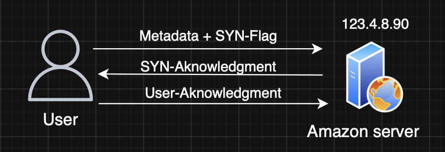
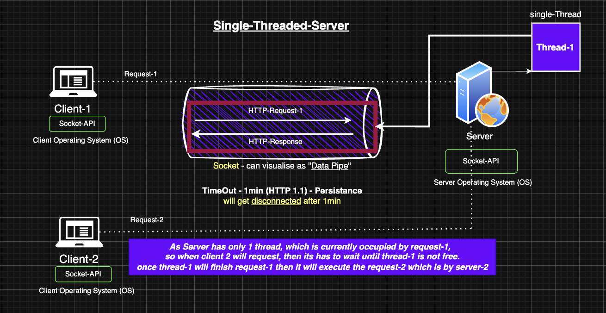
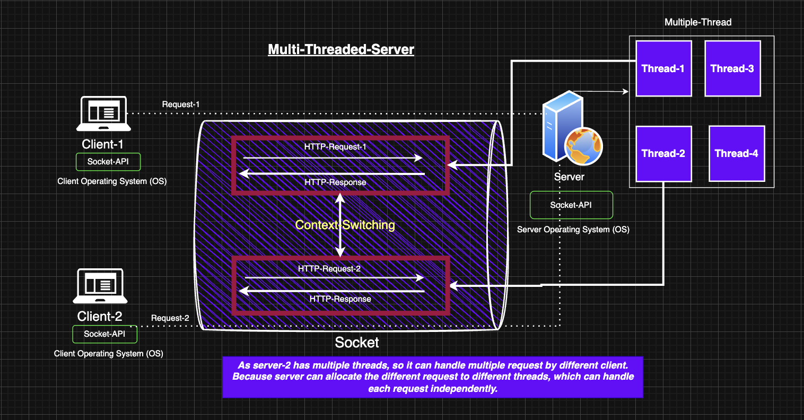

# 📌 Multithreaded Web Server in Java

A performance-focused backend project comparing single-threaded vs multi-threaded servers using Java, built to understand **how different server models handle 10K Requests Per Second (10K RPS)**.

Designed and implemented core networking logic from scratch using _**Java’s ServerSocket, threads, and ExecutorService**_, this project explores low-level performance, concurrency, and system resource management.

## 🧠 What I Learned
- **Core networking concepts :** TCP, sockets, and HTTP request lifecycle
- Difference between **thread-per-request vs thread-pool-based servers**.
- **Performance bottlenecks** in high-load servers and how to solve them using thread pools.
- **Java concurrency**: ExecutorService, task queues, and resource optimization.

## 🚀 How to Run

**Basic terminal / command line**

#### Run Single-threaded Server:

    cd single-threaded
    javac SingleThreadedServer.java
    java SingleThreadedServer
#### Run Multi-threaded Server:

    cd multi-threaded
    javac MultiThreadedServer.java
    java MultiThreadedServer

**Use tools like Apache JMeter, wrk, or ab (Apache Benchmark) to test 10K RPS.**

## 🔍 Concepts Explored
    1. TCP 3-way Handshake

    2. HTTP 1.0 vs 1.1 vs 2.0

    3. Sockets & Communication Protocols

    4. Thread Control Block (TCB) and memory implications

    5. Java Thread Management: ExecutorService, ThreadPoolExecutor

    6. Task Queues & Load Distribution

### 📷 Single-Threaded vs Multi-Threaded

## 💡 Why This Project?
_As a backend engineer, I built this project **to strengthen my understanding of how servers work at a low level**, and how to make them more efficient under real-world load. This project simulates a backend system under high traffic, allowing me to explore and compare system behavior, which is often critical in scalable system design._

### 🙋‍♂️ Author
**Naimish K** |

Backend Engineer | Java | System Design | Multithreading
